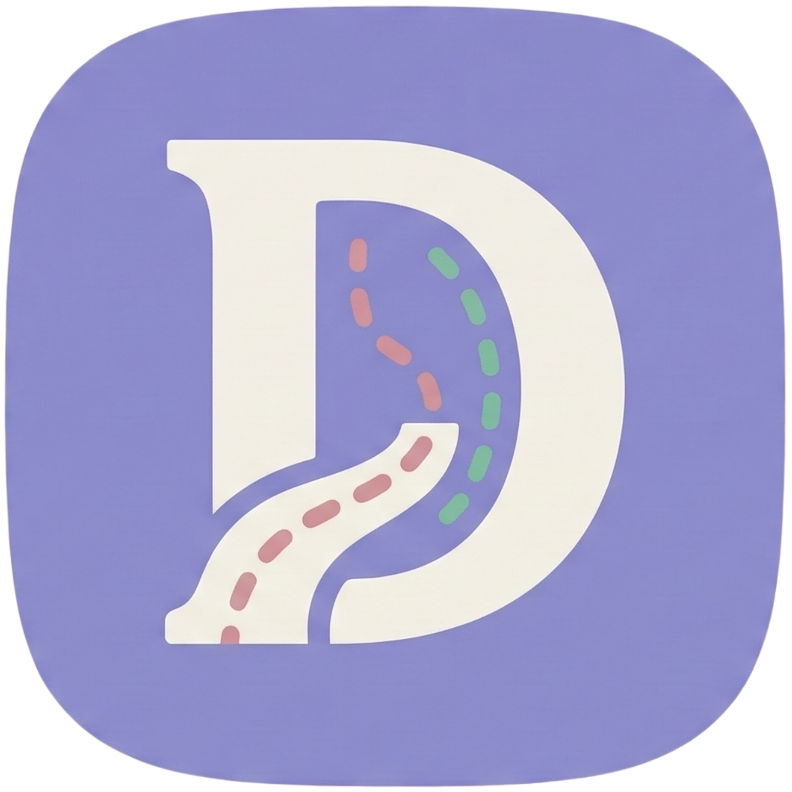
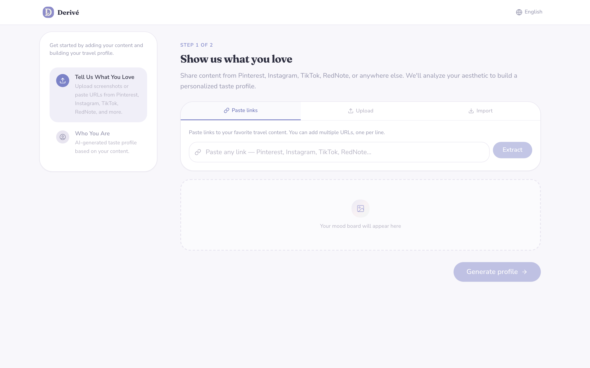
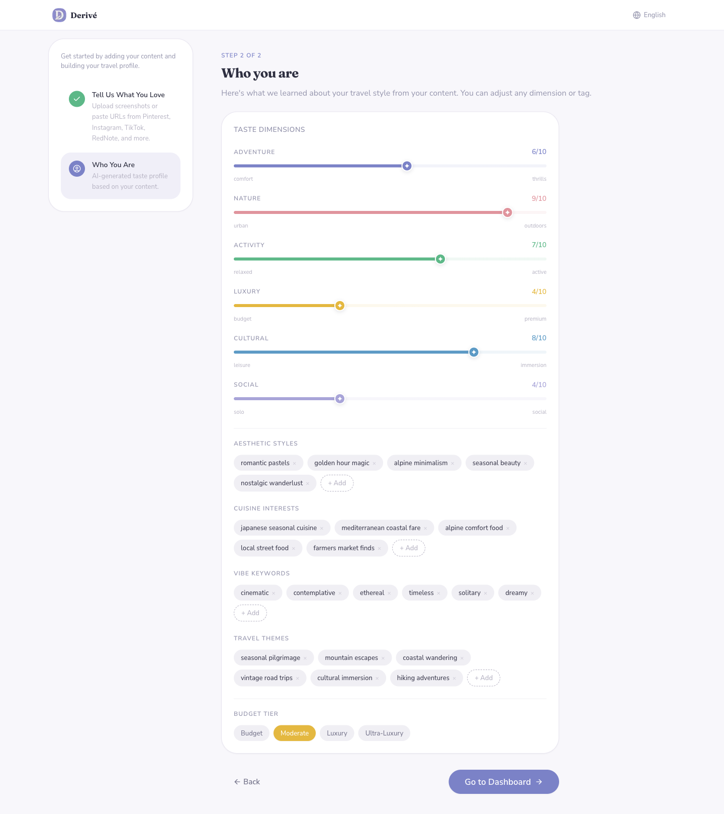
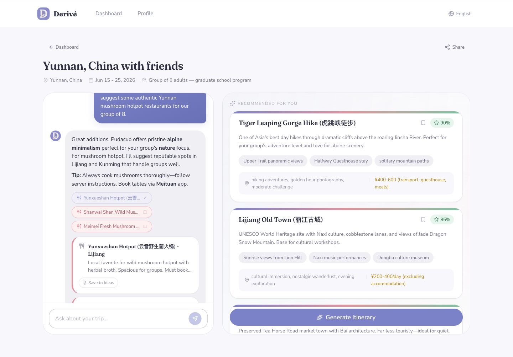

<p align="center">
  
</p>

<h1 align="center">Derive</h1>

<p align="center">
  <strong>Travel planning that reads your taste.</strong><br/>
  AI-powered trip planning built on your actual aesthetic — not a generic questionnaire.
</p>

<p align="center">
  <a href="https://derive-app.vercel.app">Live App</a>
</p>

---

## What makes Derive different

Most AI trip planners ask the same questions: *Where are you going? When? What's your budget?* Then they generate the same itinerary everyone else gets.

Derive flips this. Instead of telling the AI what you want, you **show it what inspires you** — Pinterest boards, Instagram saves, TikTok videos, RedNote posts — and it builds a multi-dimensional taste profile that understands *how* you travel, not just *where*.

| | Derive | Typical AI Planners |
|---|---|---|
| **Input** | Mood boards, social media, photos | Destination + dates + budget form |
| **Personalization** | 6-dimension taste profile from your content | None, or a multiple-choice quiz |
| **Workflow** | Conversational — chat to refine | Rigid step-by-step wizard |
| **Itinerary editing** | Drag-and-drop with ideas bucket | Static list, maybe reorderable |
| **Sharing** | Editable collaborative pages | Read-only links |
| **Regional expertise** | Dual-model (Claude + DeepSeek for China) | Single global model |

---

## How it works

### 1. Show us what you love

Share content from Pinterest, Instagram, TikTok, RedNote, YouTube, or upload images directly. Derive extracts visual patterns, aesthetic preferences, and activity signals to understand your travel style.

<p align="center">
  
</p>

### 2. Your taste profile

AI analyzes your content and generates a 6-dimension profile: Adventure, Nature, Activity, Luxury, Cultural, and Social — plus aesthetic styles, cuisine interests, vibe keywords, and travel themes. Every dimension is adjustable.

<p align="center">
  
</p>

### 3. Plan through conversation

Create a trip and chat naturally with the AI. It uses your taste profile to recommend places that actually match your style — not the same top-10 list everyone else gets. Bookmark favorites, ask for alternatives, refine as you go.

<p align="center">
  
</p>

### 4. Build your itinerary

Drag activities between days, reorder within a day, stash ideas in the bookmarks bucket for later. Switch between list and map views. The AI can also modify the itinerary directly — "swap the temple visit for something more relaxed" just works.

### 5. Finalize and share

Generate a shareable link. Recipients can view the full itinerary, explore the map, and even chat with the AI to ask questions about the trip.

---

## Key features

- **Taste profile engine** — Builds a rich traveler profile from social media content, not just stated preferences
- **Multi-platform import** — Pinterest (OAuth), Instagram, TikTok, RedNote, YouTube, direct image upload, data exports
- **Conversational planning** — Natural chat interface with streaming responses, not a rigid form wizard
- **Smart recommendations** — Personalized to your taste dimensions, budget tier, and travel style
- **Drag-and-drop itinerary** — Reorder activities, move between days, stash ideas in a bookmarks bucket
- **Dual AI routing** — Claude for global destinations, DeepSeek for Greater China (local names, apps, practical tips)
- **Interactive map view** — See all activities plotted with coordinates, toggle between list and map
- **Shareable itineraries** — Token-based links with optional collaborative editing and AI chat
- **Budget-aware** — Recommendations respect your tier (budget/moderate/luxury/ultra-luxury) in local currency
- **Multi-language** — English, Spanish, French, Simplified Chinese

---

## Tech stack

- **Framework**: Next.js 16 (App Router, React 19)
- **Database**: Supabase (PostgreSQL + Row Level Security)
- **AI**: Claude 3.5 Sonnet + DeepSeek Chat, via Vercel AI SDK
- **Styling**: Tailwind CSS 4 with custom design tokens
- **Maps**: Leaflet with OpenStreetMap tiles
- **Drag & Drop**: dnd-kit
- **Deployment**: Vercel

---

## Getting started

```bash
# Install dependencies
npm install

# Set up environment variables
cp .env.example .env.local
# Fill in: SUPABASE_URL, SUPABASE_ANON_KEY, ANTHROPIC_API_KEY, DEEPSEEK_API_KEY

# Run development server
npm run dev
```

Open [http://localhost:3000](http://localhost:3000).

---

## Project structure

```
src/
├── app/                    # Next.js App Router pages
│   ├── api/                # API routes (chat, itinerary, profile, share, etc.)
│   ├── dashboard/          # Trip dashboard
│   ├── onboarding/         # Taste profile generation flow
│   ├── share/[token]/      # Shared itinerary pages
│   └── trip/[id]/          # Trip workspace (chat + itinerary)
├── components/
│   ├── itinerary/          # Itinerary view, day rows, activity cards, map
│   ├── planning/           # Chat thread, recommendation cards, trip brief
│   ├── onboarding/         # Content import, image upload, URL input
│   ├── profile/            # Taste profile display and editing
│   └── ui/                 # Shared components (buttons, cards, inputs)
├── lib/
│   ├── ai/                 # AI prompts and provider routing
│   ├── content/            # Platform extractors (Instagram, Pinterest, etc.)
│   ├── i18n/               # Translations (en, es, fr, zh)
│   └── supabase/           # Database client
└── types/                  # TypeScript interfaces
```

---

## License

Private project. All rights reserved.
